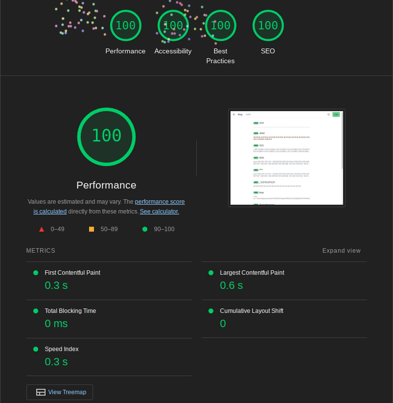

# Issue blog

[Demo](https://issue-blog.thect.cc)

Issue blog is a blog platform built on top of GitHub repository issues. Use the issue feature to compose and manage posts.

[TOC]

## Getting Started

1. Register an OAUTH app on GitHub
   You can find instructions [here](https://docs.github.com/en/apps/oauth-apps/building-oauth-apps/creating-an-oauth-app).
2. Clone the repo

    ```sh
    git clone https://github.com/cheetosysst/issue-blog
    ```

3. Create environment variables
   Copy `.env.example` as `.env.local`, and fill in the variables.
   You can find the client id and secret in the oauth app you just created.
   Point `REPO` to the repo you want to use.
    > The repo **must** be a public repo.
4. Run the project

    ```bash
    pnpm i
    pnpm dev
    ```

Open [http://localhost:3000](http://localhost:3000) with your browser to see the result.

## Design

See [design](./docs/design.md) for detail.

### Rendering

#### 過去的經驗

先前我有開發 Next.js 12~13 的經驗，對於 Page router 有相對較為完整的認識和高熟悉度。在其他專案中也有研究過修改 React 渲染 Pattern，所以對其運作方式也有一定的基礎。

在過去的經驗中我對於前端開發最大的問題是在客戶端操作時各項流程的低效，以及行動裝置本身的效能問題。在學習前端開發過程中我逐漸轉向「盡可能把所有工作都交給伺服端」，藉此降低客戶的負擔。為此我進行過一些嘗試，期中包含使用 HTMX 處理客戶端的互動，將後端渲染的 HTML 片段送到前端貼上到特定區塊。雖然客戶端的工作量大幅降低，這也讓撰寫高互動性的體驗多了一點難度。

這次使用 Next.js 的 app router 以及 React Server Component 理論上解決了很多我先前遇到的諸多問題，可以讓伺服器處理大部分的工作，避免客戶端額外的渲染工作，也能夠利用 Streaming 的方式讓網頁中大部份內容先送到客戶端，再等待資料到齊後補上。

#### 本次的嘗試

##### 首頁

在首頁我採用了先在伺服器端生成 10 篇文章按鈕，其後當頁面尾部進入 Viewport 時，於尾部的 Client Component 透過 Intersect Obeserer API 呼叫 Server Action 取得下十筆資料，於客戶端渲染

實際的成果載入速度相當快速，基本不需要多少優化，但我還是改寫讓文章內容可以在 Suspense 中非同步的載入。

在下方的 Infinite Scroll 區塊則是遇上一些阻礙。原先我希望能夠利用伺服器不斷的產生新的區塊，以作到預期的效果。然而，我很快發現雖然我的作法能夠成功在負責監聽 Client Intersection 的 Client Component 中呼叫 Server Component，除了會在客戶端跳出警告，伺服器端也會出現瀑布渲染。


而即使解決以上兩個困難，這項寫法也會造成管理 DOM 上的問題。我們不能讓 DOM 內容倍數增長，也不能放任 DOM tree 深度增加。

為此我去讀了 Server Action 的文檔，發現他不允許回傳元件。具體的理由我還沒有很理解，有個查到的解釋是不能序列化，但是如果確定內容都會在伺服器端完成，我想不到不能夠單純傳渲染結果的理由。這個部份應該再度深入研究一下，了解具體原因，或是有沒有其他作法。

但是現有把新渲染區塊交給客戶端處理的作法因為資料量不大，其實是綽綽有餘了。

#### 文章瀏覽頁面

因為 GitHub Issue 使用 GitHub Flavored Markdown 格式 (GFM)，我在伺服器端使用 react-markdown 和 remark-gfm 渲染原始內容。如此一來我們可以避免在不必要時把 markdown compiler 送到客戶端。


在客戶端，我們則是利用 [Tailwind Typography](https://github.com/tailwindlabs/tailwindcss-typography) 提供好看且易於閱讀的 Styling。

#### 新增 / 編輯文章


在編輯頁面時，我們使用的編輯器元件是通用的，不過可以根據需求選擇 `POST` 或是 `PATCH` 模式。

可以注意的是上方的 `Preview` 按鍵，點擊後可以看到即時渲染的預覽。


在這邊我們會動態載入 Markdown 渲染的相關套件到客戶端，完成必要的渲染工作。

原先我打算使用 Facebook 的 lexical 編輯器，以提供 WYSIWYG 的體驗，但經過一段時間的測試我發現他不太好使用，有很多難以解決的 bug 和 edge case，以及不怎麼好看的 Pattern。但最重要的是我沒辦法確保他渲染結果和我預期的一樣，所以我選擇放棄使用它，轉為使用更簡單的 `textarea` 和預覽視窗。雖然比不上 WYSIWYG 的使用體驗，卻可以降低我現在程式的複雜程度。未來可以調整現有的界面（原先為了 lexical 做的排版），改成類似 HackMD 那樣左右排版的方式。

而在這裡我有做了提交文章的 server action，當提交遇到問題（字數、網路錯誤），網站會妥善的錯誤處理並顯示提示。

### API 和錯誤處理

原先我有考慮使用 GitHub 提供的 octocat 套件和 NextAuth 來做登入和 API 串接，但是後來我決定嘗試自己實做。

在 Repo 中可以看到有個資料夾 `github`，我把所有的 API 都根據其
分類整體在裡面。每個 API 串接時我只會提供函式我需要用到的 argument，且有利用 TS 做好檢查。

在呼叫 GitHub 後，我會利用 valibot 對回傳結果進行 schema 確認。而這個過程會把回傳內容中我站實用不到的欄位藏起來，避免我誤用。

如果請求出錯，或是回傳結果格式和預期的定義不同，我會在錯誤處理時回傳一份空資料，以及錯誤訊息，讓取用資料的地方有辦法恢復錯誤，或是至少不讓網站中其他地方邏輯停擺。

```ts
async function foo(prop: Bar) {
	const res = await getData(props.data) // expected: { data: ["foo", "bar"] }
		.catch((error) => {
			console.error(error);
			return { data: [] };
		});
	return res.data.map(/* */);
}
```

Issue 相關的 API 回傳內容包含了 Issue 本身內文，所以相關的 API 在串接時我增加了選項供調整回傳內容的格式是 Mardkown 或是純內文，以提供文章顯示和首頁文章預覽的不同需求。

### Styling

Styling 我使用了 TailwindCSS + DaisyUI 的組合，前者提供了相當大彈性的 CSS 寫法，後者則是提供了諸多優秀的內建純 CSS 元件和主題。

除此之外如同先前提到的，我利用 Tailwind Typography 為渲染出的 Markdown 內容上 Styling。如此一來，我不需要手動維護和一個個的撰寫每個 HTML Tag 的 styling，只需要對特定特例額外處理。

### File Stucture

由於 DaisyUI 已經提供了相當多優秀的元件 css class，減少了需要在重新撰寫的共用元件數量。在 `/src/component` 中可以看到少數幾個需要特別處理的元件，當中包含有較為複雜的互動性的元件（Editor）。

其他一次性的元件，或使用方式泛用性較低的元件，我會讓他保留在距離使用地點較近的路徑。

### Type

在這個 Repo 中我用到了兩個主要的型別，分別是 `User` 和 `Issue`，都來自 GitHub API 的規格。

在 `/src/types` 中可以找到對應的 Valibot schema 和型別，注意只有部份的內容被定義，在實際檢查型別時我會忽略調用不到的資訊。

這是為了確保整個專案中共用相同的型別，不會有各自為政的狀況。

在呼叫 GitHub 的相關檔案中可以找到使用這些 Schema 做型別驗證的地方，事實上撰寫過程中有很多次這些型別檢查替我抓到了疏忽的邏輯細節。

### Features

-   GitHub Authentication
-   Post Management
    -   Create
    -   Edit
    -   Delete (Close issue)

### Web Vital

-   本地測試 Lighthouse 成績

    

-   部屬測試 Lighthouse 成績

    
